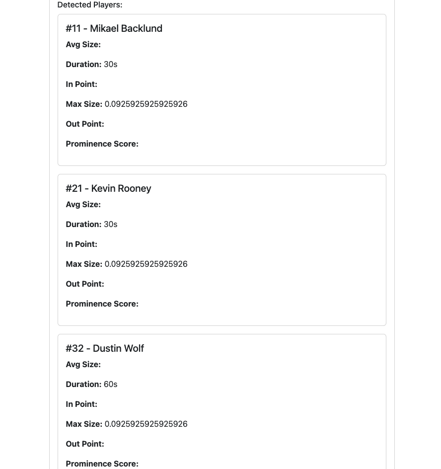
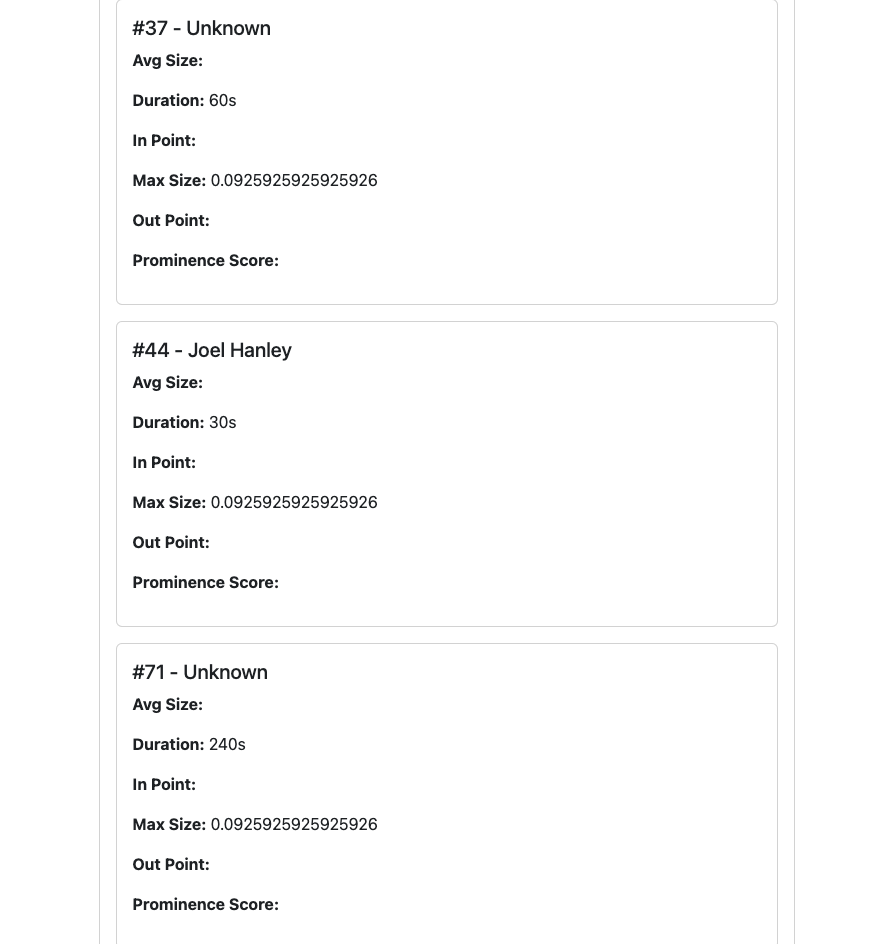

# 🎥 Video Processor

**Video Processor** is a SaaS-style AI toolkit that ingests video files, automatically detects player jersey numbers and on‑screen text, and computes key performance metrics. Built as a microservices ecosystem, it leverages Next.js, Node.js, Prisma, Python, and Firebase to deliver a seamless end-to-end pipeline—from ingestion through OCR/text detection to analytics and front-end visualization.

---

## 📦 Architecture & Services

```
┌────────────────┐     ┌───────────────────┐     ┌─────────────────┐
│                │     │                   │     │                 │
│   Saas-Client  │◀───▶│     Saas-Web      │◀───▶│     Seed        │
│  (React + FB)  │     │ (Next.js + API)   │     │ (Prisma + DB)   │
│                │     │                   │     │                 │
└────────────────┘     └───────────────────┘     └─────────────────┘
                            │   ▲
                            │   │
                            ▼   │
                  ┌─────────────────────┐
                  │                     │
                  │  Saas-Processor     │
                  │ (Next.js + Node.js) │
                  │                     │
                  └─────────────────────┘
                            │
                            ▼
                  ┌─────────────────────┐
                  │                     │
                  │   OCR-Service       │
                  │ (Python + OpenCV)   │
                  │                     │
                  └─────────────────────┘
```

| Service            | Description                                                                                                                                                      |
| ------------------ | ---------------------------------------------------------------------------------------------------------------------------------------------------------------- |
| **Seed**           | Node.js service using Prisma to connect, migrate, and seed the PostgreSQL database with initial schemas and sample data.                                         |
| **Saas-Web**       | Next.js backend/API that handles CRUD operations on matches, players, and analytics records; exposes RESTful endpoints for the front end and processor services. |
| **Saas-Processor** | Next.js/Node.js worker that ingests raw videos, stores them in Firebase Storage, tracks processing state, and kicks off OCR/text-detection jobs.                 |
| **OCR-Service**    | Python microservice (Flask + OpenCV + PaddleOCR) that extracts frames, runs OCR to detect jersey numbers/text, and returns structured JSON results.              |
| **Saas-Client**    | React single-page application that visualizes processed game data, displays video playback, and renders computed metrics/heatmaps via Firebase‑hosted assets.    |

---

## 🛠️ Prerequisites

* **Docker & Docker Compose** (v20+)
* **Node.js** (v18 LTS)
* **Python** (v3.9+)
* **Firebase CLI** (for Storage emulation & local testing)
* A **Firebase Storage** bucket configured for public or authenticated reads
* A **Google Service Account** JSON key with Storage permissions

---

## 🚀 Quickstart

1. **Clone the repo**

   ```bash
   git clone https://github.com/your-org/video-processor.git
   cd video-processor
   ```

2. **Copy your secrets**

   ```bash
   # Front-end client
   cp path/to/your/serviceAccountKey.json saas-client/src/utils/serviceAccountKey.json

   # Video processor
   cp path/to/your/serviceAccountKey.json saas-processor/src/utils/serviceAccountKey.json
   ```

3. **Configure environment**
   Copy the example env files and fill in your Firebase project details:

   ```bash
   cp .env.example saas-client/.env.local
   cp .env.example saas-processor/.env.local
   cp .env.example saas-web/.env.local
   cp .env.example ocr-service/.env
   ```

4. **Build & start all services**

   ```bash
   docker-compose up --build
   ```

5. **Access UI & APIs**

   * **saas-client**: [http://localhost8080](http://localhost:8080)
   * **saas-web**:    [http://localhost:3003/api](http://localhost:3003/#api)
   * **saas-processor**:    [http://localhost:3002/api](http://localhost:3002/#api)
   * **OCR**:    [http://localhost:5000](http://localhost:5000)

---

## 🔧 Service Endpoints

### Seed

* `POST /seed`
  Run database migrations & seed initial data.

### Saas-Web (Next.js)

* `GET /api/matches`
* `POST /api/matches`
* `GET /api/players/:id`
* `PUT /api/players/:id`
* `DELETE /api/players/:id`

### Saas-Processor

* `POST /api/process`
  Kick off video processing for a given match.
* `GET /api/status/:jobId`
  Poll processing status & metrics.

### OCR-Service (Flask)

* `POST /ocr`
  Accepts JSON payload `{ videoUrl: string }`, returns `[{ frame: number, text: string, playerId: string }]`

---

## 📊 Workflow

1. **Upload a game video** via the SaaS-Client.
2. **Saas-Web** stores metadata in Postgres.
3. **Saas-Processor** pulls the video from Firebase Storage and calls OCR-Service.
4. **OCR-Service** returns detected text/jersey numbers per frame.
5. **Saas-Processor** computes metrics (total play time, heatmap of most-frequent players, etc.) and writes results back to the DB.
6. **Saas-Client** visualizes the video alongside interactive charts and statistics.

---

## ⚙️ Configuration & Environment Variables

| Service           | ENV VAR                   | Description                                            |
| ----------------- | ------------------------- | ------------------------------------------------------ |
| Client / Web SDK  | `REACT_APP_…`             | Firebase config keys (`apiKey`, `authDomain`, etc.)    |
| Processor / Web   | `FIREBASE_STORAGE_BUCKET` | Your bucket (e.g. `video-processor-d7410.appspot.com`) |
| OCR-Service       | `OCR_MODEL_PATH`          | Path to your PaddleOCR model files                     |
| All Node services | `DATABASE_URL`            | PostgreSQL connection string                           |


## 📸 Screenshot

Below is a screenshot of the application in action:




